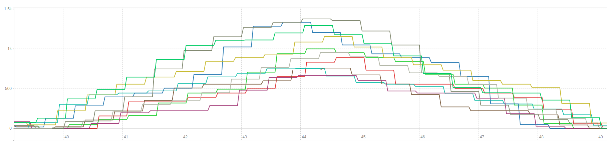

# kortance

```shell script
deen@bulldozer:~/gh/kortance$ ./gradlew installDist
deen@bulldozer:~/gh/kortance$ ./build/install/kortance/bin/kortance 127.0.0.1 1883 -w 10 -j 1 -m 10
```

## Globale Optionen

| Shorthand | Name          | Default | Description                                                     |
|-----------|---------------|---------|-----------------------------------------------------------------|
| -u        | --username    | -       | Der Benutzername, der von allen Clients verwendet wird.         |
| -p        | --password    | -       | Das Passwort, das von allen Clients verwendet wird.             |
| -s        | --secure      | false   | Ob die Verbindung via TLS aufgebaut wird.                       |

## Szenarien 

### Stress


In diesem Szenario steigt die Nutzerzahl bis zu einem Peak und nimmt ab diesem Punkt wieder ab. 
Dieses Szenario kann z. B. genutzt werden, um die automatische Skalierung des Brokers zu testen.

| Shorthand | Name          | Default | Description                                                     |
|-----------|---------------|---------|-----------------------------------------------------------------|
| -w        | --waves       | 10      | Die Anzahl der Wellen die gestartet werden sollen.              |
| -j        | --jobs        | 10      | Die Anzahl der Jobs oder Clients pro Welle.                     |
| -m        | --messages    | 1000    | Die Anzahl der Nachrichten pro Job.                             |
|           | --payloadSize | 150     | Die Größe des zufällig generierten Nachrichteninhalts in Bytes. |
| -d        | --delay       | 30000   | Die Verzögerung zwischen den Wellen in Millisekunden.         

### Soak (Nicht implementiert)
In diesem Szenario steigt die Nutzerzahl bis zu einem Schwellwert und verharrt dort bis die Anwendung terminiert wird.
Mit diesem Szenario können die Langzeiteffekte wie z. B. Memory Leaks getestet werden.

### Spike (Nicht implementiert)
Dieses Szenario veröffentlich schnellstmöglich die definierte Zahl an Nachrichten, um das Verhalten unter extremer Last zu beobachten.

