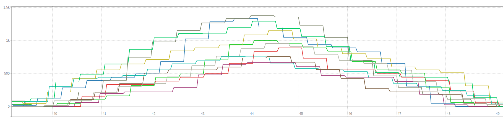
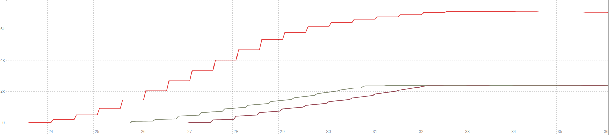
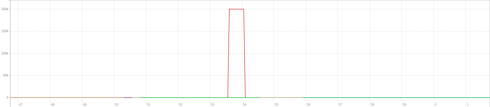

# kortance

MQTT load testing made easy. :gun:

### Installation

Kortance binaries are currently available for macOS and ubuntu. Feel free to contribute if you want kortance to be
available through apt, brew or whatever package manager you prefer. :)

1. `wget https://github.com/SmartsquareGmbH/kortance/releases/download/<version>/kortance-ubuntu-latest`
2. `sudo chmod +x ./kortance-ubuntu-latest`
3. `sudo mv ./kortance-ubuntu-latest /usr/local/bin/kortance`

## Global Options

| Shorthand | Name          | Default |
|-----------|---------------|---------|
| -u        | --username    | -       | 
| -p        | --password    | -       | 
| -s        | --secure      | false   |

## Scenarios

Kortanes offers three load testing scenarios either for testing spikes, long lasting load or wave loading.

### Stress

This scenario spawns waves of clients which publish thousand messages each per default.
This can for example be used to test the (automatic) horizontal broker scaling.

| Shorthand | Name          | Default | Description                                                     |
|-----------|---------------|---------|-----------------------------------------------------------------|
| -w        | --waves       | 10      | The number of waves.                                            |
| -j        | --jobs        | 10      | The amount of clients per wave.                                 |
| -m        | --messages    | 1000    | The number of messages published by each client.                |
| -d        | --delay       | 30000   | The delay between each wave.                                    |

### Soak

This scenario spawns a defined number of users which publish messages until the program is terminated.
This can be useful for testing the long-term behaviour or detect memory leaks.

### Spike

This scenario publishes the defined number of messages asap to test the behvaiour during load spikes.

| Shorthand | Name          | Default | Description                                                     |
|-----------|---------------|---------|-----------------------------------------------------------------|
| -m        | --messages    | 1000    | The number of messages published by each client.                |

